# User Flow Diagrams: Gryphon Draft

> **Source PRD:** `.plans/PRD.md`
> **Generated by:** `/project:ux-coordinator`

---

## 1. Overall Feature Map

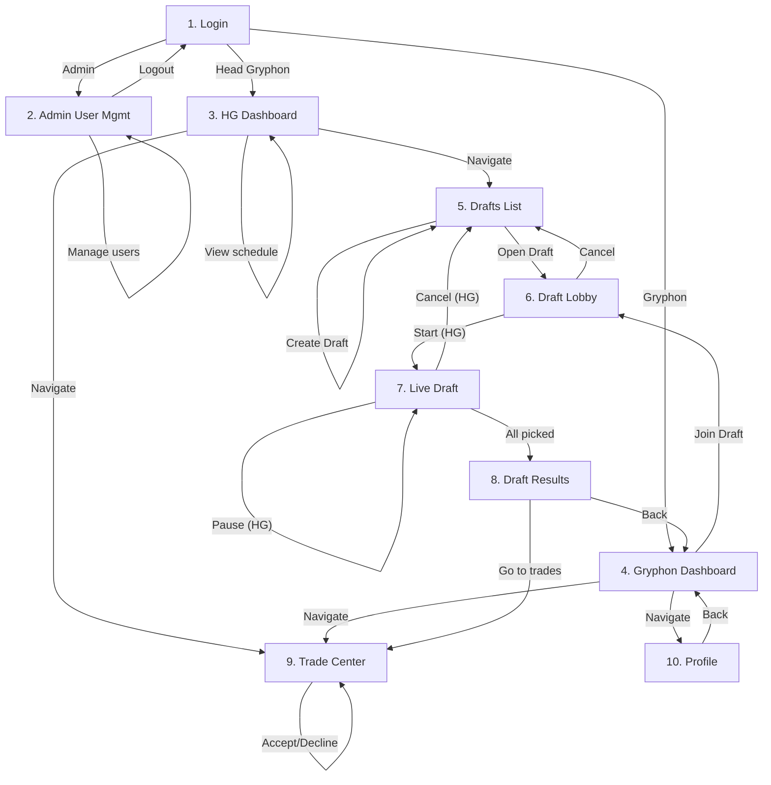

---

## 2. Authentication Flow

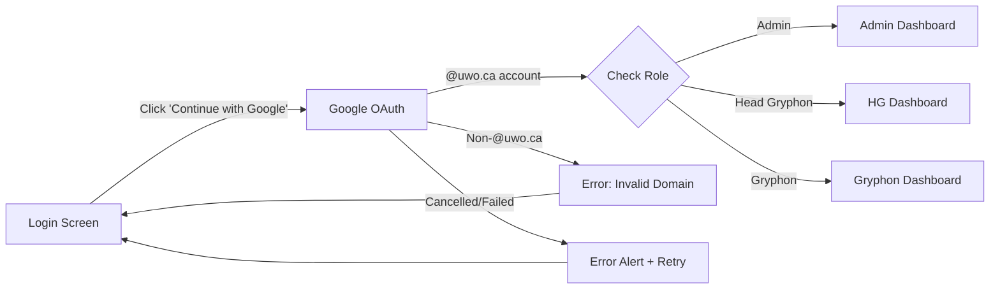

---

## 3. Draft Lifecycle Flow

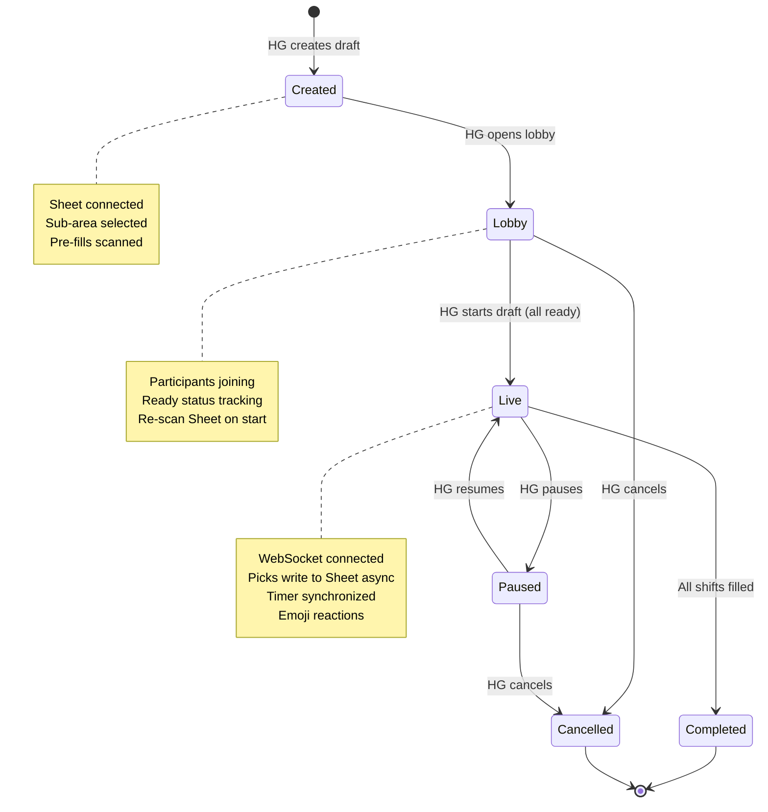

---

## 4. Live Draft Turn Flow

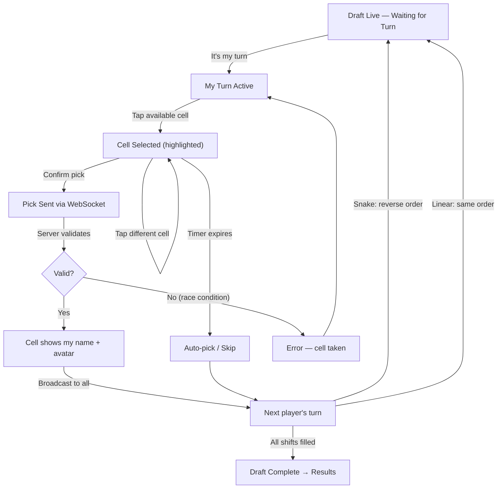

---

## 5. Draft Board Cell States

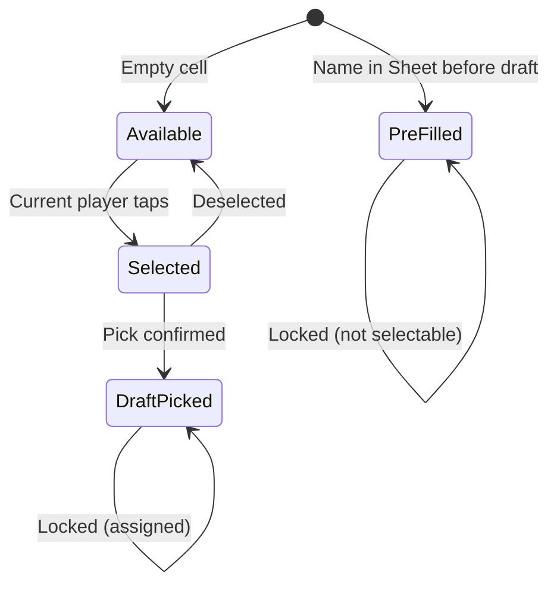

---

## 6. Trade Lifecycle Flow

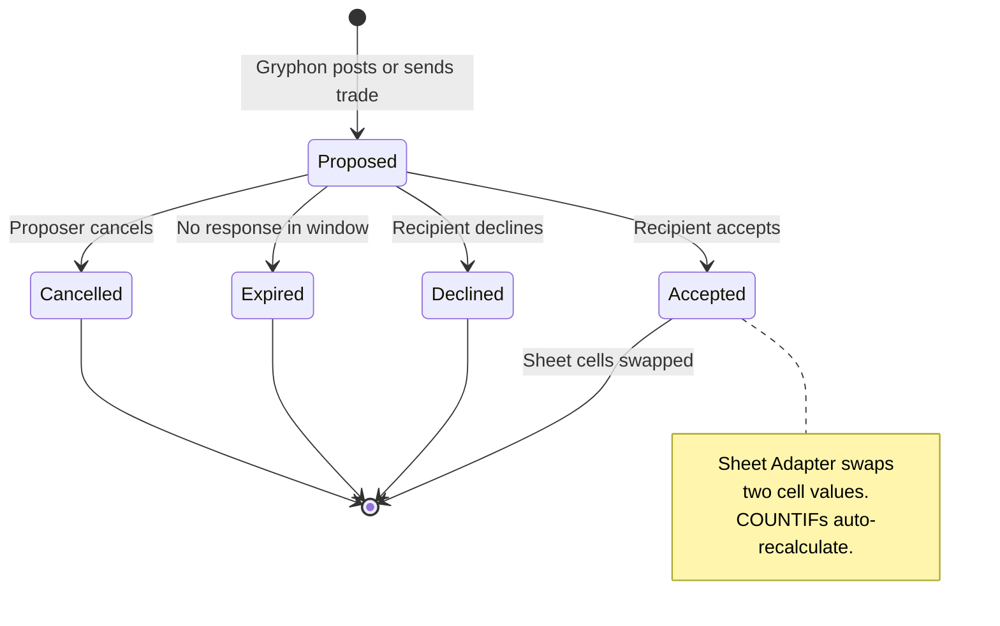

---

## 7. Trade Terminal Flow (Mobile)

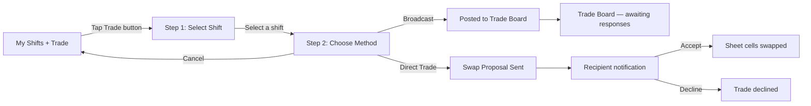

---

## 8. Sheet Import & Parsing Flow

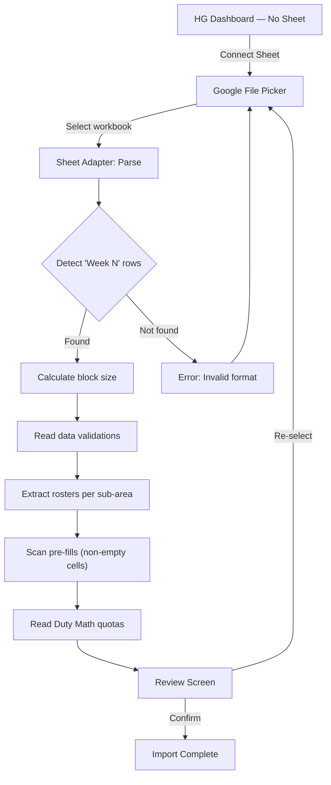

---

## 9. Mobile Navigation Structure

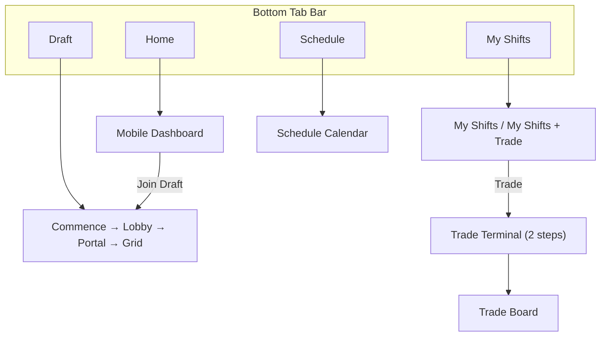

---

## 10. Desktop Navigation Structure

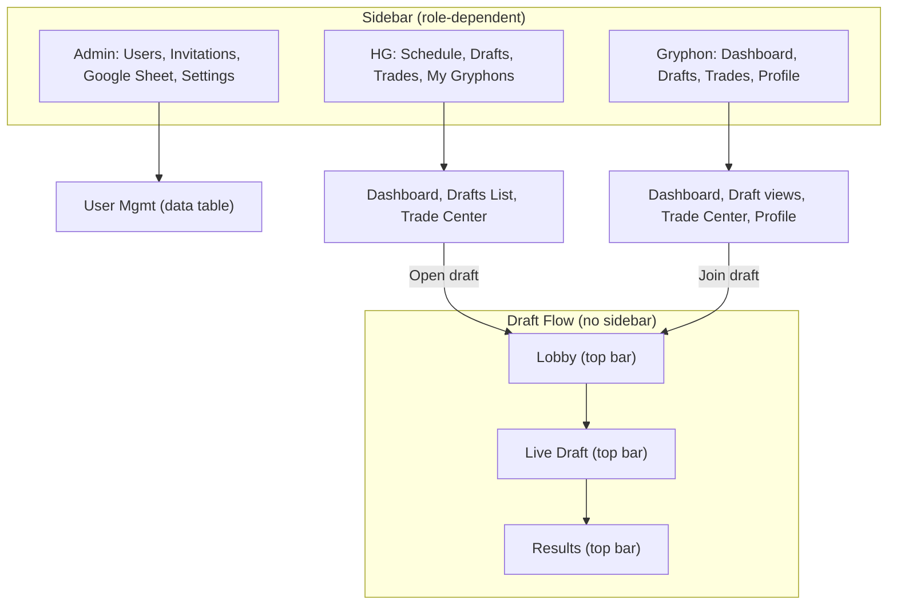

---

## 11. Real-Time Architecture (WebSocket Events)

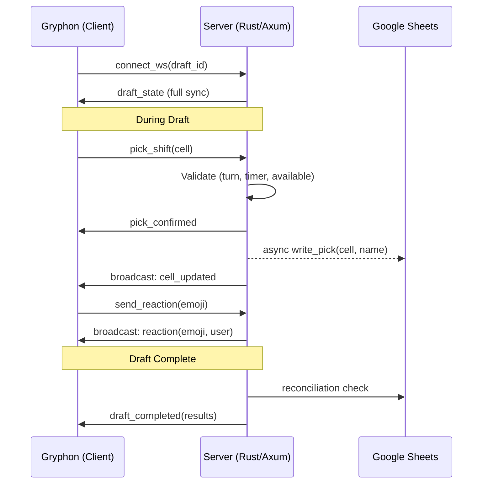
